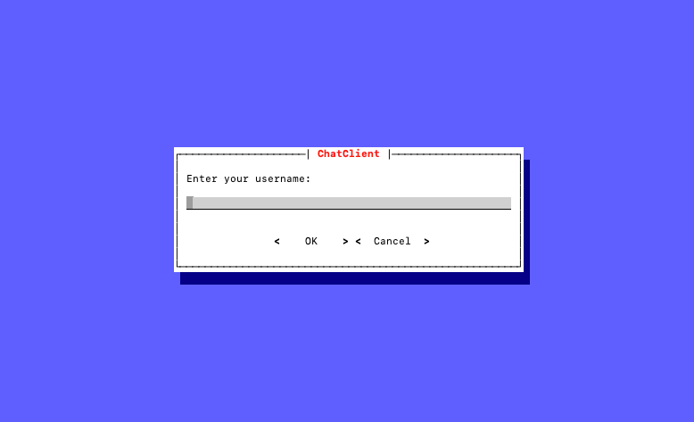
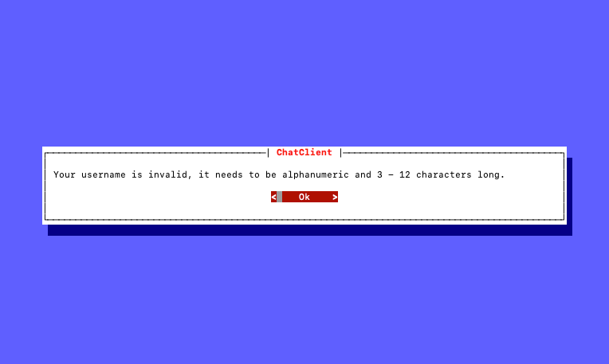

_This is course project for Programming 1 during the winter semester. This is purely educational only and should not be used in any production environments as it has serious security holes. Take a peak!_

# About the project
This project defines a custom designed binary protocol called [EchoSphere Chat Protocol](protocol.md) and alongside it includes implementation of a server and client applications supporting it.

The chat client is a python application that allows to communicate with others through a terminal window! It offers following features:
- Minimalistic terminal UI
- Effortless connectivity
- Password protected server
- User join/leave notifications
- Chat commands

# User guide

The client allows users to connect to an external server hosting the EchoSphere server and provides a terminal UI to seamlessly interface with it.

### Installation steps
Before continuing, you need to have git and python v3 installed on your computer. Please, ensure that you do have them.

1. Clone the repository: 
```bash
git clone https://gitlab.mff.cuni.cz/teaching/nprg030/2324-winter/student-bartiks.git
```
2. Get into the cloned directory:
```bash
cd student-bartiks
```
3. Install required dependencies:
```bash
pip install -r client/requirements.txt
```
4. Start the client:
```bash
python client/main.py
```

### Connecting to the server
It is really simple just as starting the client and filling out few data required to make a connection the server.

Immediately after the start a first screen pops up asking you for the username to be used during the session:



You can type the username straight away and when you are done, hit the enter key to confirm the username and to change the focus to the "OK" and "Cancel" buttons bellow the input field. Button currently in the focus will be highlighted in red colour. Hitting the enter key for the second time will submit the username, otherwise you can change the focus of the button to "Cancel" in order to exit the application.

The username needs to be 3-12 characters long and can include ONLY alphanumerical characters. If the provided username is invalid, you wil be kindly informed by an error screen such as this:



In an exactly the same way you will be prompted for other information: the server host, port and the server password. These information should be provided by your server administrator.

### Sending messages
Once you successfully join the server, other clients will be notified by a system message and you will be greeted with an empty chat window, because previous conversations stay hidden to newcomers:


You can start typing your message right away and submit it by hitting enter. The message must be at least 1 character long and at most 1000 characters long:


The server can reject a message based on its content policy, etc. In such case an error screen will be displayed.

### Commands
Commands are sent by sending a special messages starting with `/`. For now, the server supports only following commands:
- `/list`
  - Lists the currently connected users
- `/ping`
  - No users connected? Bored with the human counterparts? Poke the server! It answers, too ;)

### Disconnecting from the server
To disconnect from the server, simply close the application with the keyboard shortcut `CTRL + C`.

# Server administrator guide
### Installation steps
Before continuing, you need to have git and python v3 installed on your computer. Please, ensure that you do have them.

1. Clone the repository: 
```bash
git clone https://gitlab.mff.cuni.cz/teaching/nprg030/2324-winter/student-bartiks.git
```
2. Get into the cloned directory:
```bash
cd student-bartiks
```
3. Start the server (with default settings):
```bash
python server/main.py
```

### Configuration
The configuration of the server is done solely by passing arguments to the start command. Following arguments are accepted:
- Port: --port
  - default: 12300
- Server password: --password
  - default: None

For example, to start a server listening on port `13000` and protected with password `My_Password` you would:
```bash
python server/main.py --port 13000 --password My_Password
```
